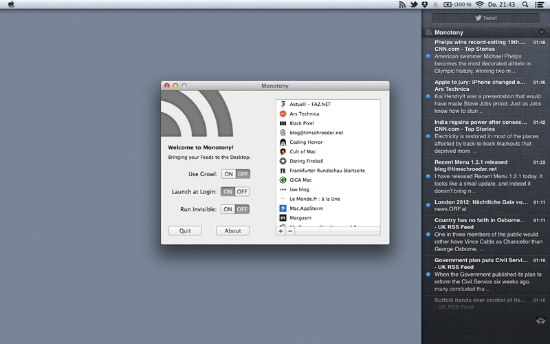

# Monotony

Monotony is a very simple feed reader. It does exactly one job: You subscribe to RSS and Atom feeds, Monotony checks for new feed entries regularly. New entries are displayed on the desktop as notifications, featuring the headline and a summary (if there’s one). To read a new feed entry in your default web browser, just click on the notification.

## Requirements

OS X 10.9 required. Monotony uses either Growl or the OS X built-in Notification Center.

## Features

* Monotony is a simple backend to bring your favourite RSS and Atom news feeds to your desktop. It doesn’t have a frontend but presents new feed entries by showing tiny little desktop notifications.
* There is nothing else. No Google Reader sync, no frontend, no possibility to customize it. Monotony runs as a menubar app or, if you choose, invisible in the background. That’s all.
* Monotony has been designed to blend with Growl, the desktop notification system, and with the OS X Notification Center.
* Subscribe to RSS and Atom feeds by entering a feed URL or a website URL. In the latter case, Monotony will look for feeds on that website. If there are several feeds available, Monotony will present them to you for selection.
* Monotony will refresh subscribed feeds every few minutes (depending on the number of subscribed feeds), presenting all new entries by showing desktop notifications. Monotony will not record or show any new feed entries if it isn’t running at that time, or if the computer is asleep.

## Screenshot

